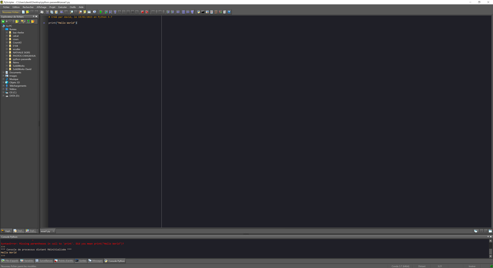

# Python

Pour fonctionner Python nécessite l'interpréteur python et un éditeur de texte (on en trouve du plus simple (notePad, Visual Code) aux plus évolués (PyCharm).

Nous allons utiliser une version "portable" qui ne nécessite pas d'installation et qui intégre tout ce dont nous avons besoin.

{% embed url="https://edupython.tuxfamily.org/#t%C3%A9l%C3%A9chargement" %}

Choisissez la **version zip**. Décompressez et executez le programme.

Vous devriez avoir la fenêtre ci-dessous

<figure><figcaption></figcaption></figure>

Lien vers un autre cours python avec les principales instructions.



Vous disposez maintenant d'une version de python sur votre poste, permettant de tester des programmes plus complet, et de les sauvegarder.

Ou un outil en ligne



## Quelques concepts de la programmation

### Les variables

Une variable est un espace de mémoire qui permet de stocker une valeur. Cette valeur peut être de différents types : entier, réel, chaîne de caractères, liste, dictionnaire, etc.

En python, on ne déclare pas le type de la variable, il est déterminé automatiquement.

```python

a = 5
b = "Bonjour"
c = 3.14
```

### Afficher quelque chose en python

Pour afficher quelque chose en python, on utilise la fonction `print()`.

```python

print("Bonjour")
```

Afficher une variable

```python

a = 5

print(a)
```

Afficher une variable avec du texte

```python

a = 5

print("La valeur de a est", a)
```

### Demander quelque chose à l'utilisateur

Pour demander quelque chose à l'utilisateur, on utilise la fonction `input()`.

```python

a = input("Quel est votre nom ? ")

print("Bonjour", a)
```

### Les opérateurs

Les opérateurs permettent de réaliser des opérations sur les variables. On distingue les opérateurs arithmétiques, les opérateurs de comparaison, les opérateurs logiques, les opérateurs d'appartenance, les opérateurs d'identité.

```python

a = 5
b = 3

c = a + b
d = a - b
e = a * b
f = a / b
g = a % b
h = a ** b

print(c, d, e, f, g, h)
```

Les opérateurs de comparaison permettent de comparer deux valeurs. Ils renvoient un booléen (vrai ou faux).

```python

a = 5
b = 3

c = a > b
d = a < b
e = a == b
f = a != b
g = a >= b
h = a <= b

print(c, d, e, f, g, h)
```

### La syntaxe de python

La syntaxe de python est très simple. Les blocs de code sont délimités par l'indentation. Il n'y a pas de caractères spéciaux pour délimiter les blocs de code (comme les accolades en C, par exemple).

```python

a = 5
b = 3

if a > b:
    print("a est plus grand que b")
else:
    print("a est plus petit que b")
```
